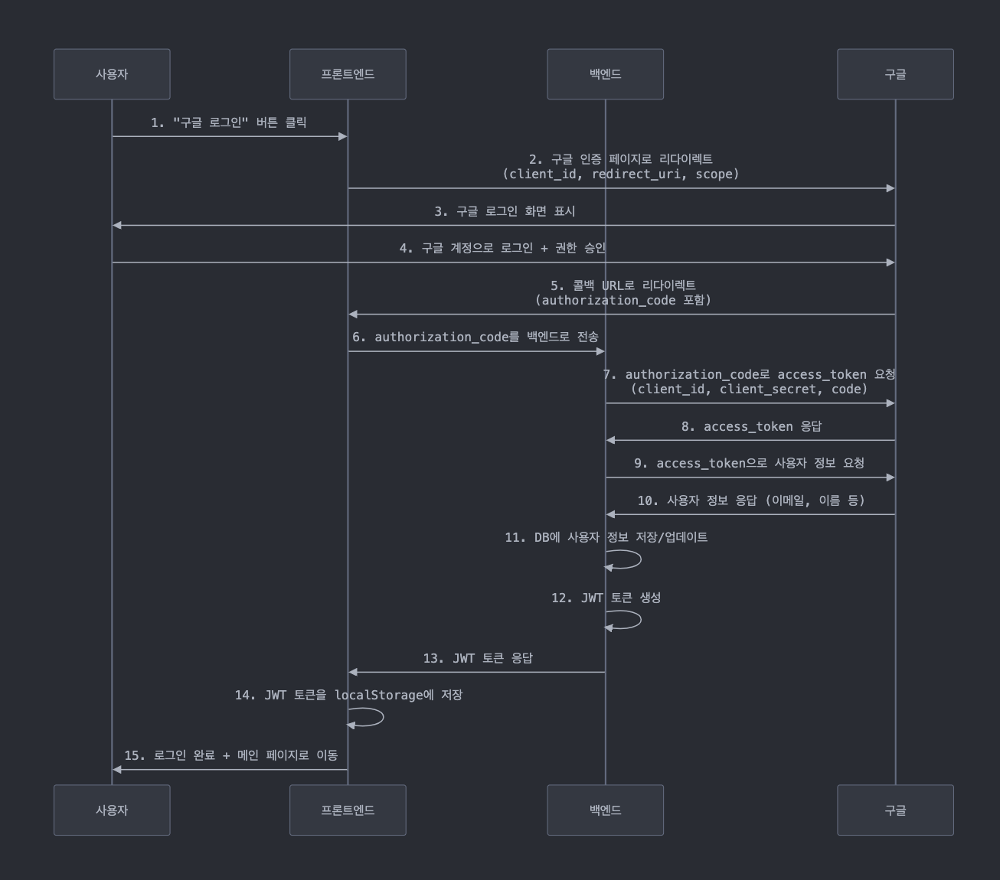

# Google OAuth2.0 가이드

## 전체 흐름 다이어그램

### 프론트 관점에서 OAuth
1. 앱 시작 → 기존 토큰 확인
2. 로그인 버튼 클릭 → 구글 인증 페이지로 리다이렉트
3. 구글 인증 완료 → `/auth/callback` 으로 authorization code와 함께 돌아옴
4. CallbackPage → authorization code를 백엔드로 전송
5. 백엔드 처리 → 구글에서 토큰 받고 JWT 생성하여 응답
6. 토큰 저장 → localStorage or cookie + AuthContext에 저장
7. 대시보드 이동 → 인증된 사용자로 앱 사용

## 구글 클라우드 콘솔 OAuth 설정 가이드

### 1. 구글 클라우드 콘솔 접속 및 프로젝트 생성
1. 🔗 접속 및 프로젝트 생성
  - Google Cloud Console 접속: https://console.cloud.google.com/
  - 새 프로젝트 생성
2. 상단의 프로젝트 선택 드롭다운 클릭
  - "새 프로젝트" 버튼 클릭
  - 프로젝트 이름 입력 (예: "my-oauth-app")
  - "만들기" 버튼 클릭

### 2. Google+ API 사용 설정
1. 📚 API 라이브러리에서 활성화
  - 왼쪽 메뉴 → "API 및 서비스" → "라이브러리"
  - "Google People API" 검색
  - "Google+ API" 클릭
  - "사용" 버튼 클릭

### 3. OAuth 동의 화면 설정
- 왼쪽 메뉴 → "API 및 서비스" → "OAuth 동의 화면"
- 사용자 유형 선택:
  - 외부: 모든 Google 계정 사용자
  - 내부: G Suite 도메인 사용자만 (조직용)
- 앱 이름, 사용자 지원 이메일, 로고, 도메인 등등..
- 기본 범위 설정
  - "../auth/userinfo.email": "이메일 주소 보기"
  - "../auth/userinfo.profile": "개인정보 보기"

### 4. OAuth 2.0 클라이언트 ID 생성
- 🔑 클라이언트 ID 생성 과정
  - 왼쪽 메뉴 → "API 및 서비스" → "사용자 인증 정보"
  - "+ 사용자 인증 정보 만들기" 클릭
  - "OAuth 2.0 클라이언트 ID" 선택
  - 애플리케이션 유형: "웹 애플리케이션" 선택

## 중요한 부분
- 앱 시작시 토큰 검증 로직 체크
  - refresh token
- access token 관리
- 환경변수(env) github에 안올라가도록 주의!
  - GitHub에 푸시하지 않도록 .gitignore 설정
- Axios 인터셉터로 401/403 오류 시 자동으로 refresh token 사용

### Reference
- [OAuth 2.0을 사용하여 Google API에 액세스하기](https://developers.google.com/identity/protocols/oauth2?hl=ko)
